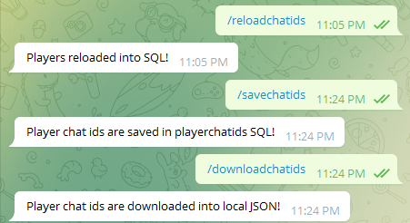

# yeozhenhao's Angel and Mortals Dual Telegram Bots

Send anonymous messages between angels and mortals using two bots!

Start off anonymous except that your interests, two truths and one lie, and a self-intro are revealed to each other.

All you need is to collect the Telegram usernames, gender, interests, two truths and one lie, and their self-intro to start playing the game!

\
***Mortal sends message to Angel using AngelBot***

\
***Instantly, Angel receives message from Mortal on MortalBot***


### Personal thoughts
- I felt that revealing the gender was important to contextualise the conversation
- Interests, two truths and one lie & self-intro were added to encourage people to break the ice & start the conversation.\
I felt these info were **essential** with the COVID19 restrictions & online learning, as students may never be able to physically meet each other.
- This bot can be just as effective as a matchmaking bot (with everyone getting two potential matches) using introduction, interests & two truths one lie to break the ice. But this bot still enables some form of anonymity (hopefully more exciting?).


### Accreditation
Special thanks to **Kingston Kuan** for his ***"How to make an Angels & Mortals Telegram Bot"*** guide! I have literally nil coding experience and his structured coding was easy to interpret and learn about the Telegram python module so I could work on it further. Please check out his article if you want to learn the basics of how this bot works! https://chatbotslife.com/building-a-chatbot-for-angel-mortal-5d389ab7acde


## What I added
1. Dual bot function:
- if you send a message to the Mortal Bot, your mortal receives it on the Angel Bot |\
if you send a message to the Angel Bot, your angel receives it on the Mortal Bot
####
- **SUPPORTS FORWARDING photos, stickers, documents, audio, videos, and animations:** dual bots were more tricky to forward messages than with a single bot. Initally only forwarding texts worked, so I added code to download these non-text messages directly from Telegram's servers so these could be forwarded too.
####
- **only requires /start on ONE of either bot to start receiving messages:** Alternatively, you may simply type any text and it will be the same as "/start"

\
***Starting the Angel Bot***

\
***Starting the Mortal Bot***


2. Options to see Angel and Mortal's two truths one lie, self-introduction, and interests within the bots.
- However, self-introduction was not added for Angels to prevent Mortals from identifying their Angels too easily
####
- Added "Who is my mortal?" option to see their mortal's Telegram username & gender
####
- Added read_csv functions to save the aforementioned properties (e.g. interests) into the Player objects

\
***Buttons & Responses in Angel Bot***

\
***Buttons & Responses in Mortal Bot***

3. Ability to feedback to the Game Master.
- The Game Master's chat id will be used by the bot.
- A support request can be sent either through the Angel Bot or Mortal Bot
- If a message is sent, the Game Master will receive the Support request from Mortal Bot only for simplicity

\
***Game Master receives Support request from Mortal Bot***

4. Enables administrative commands within Telegram bots, restricted for use only by the Game Master.
- Under exceptional circumstances, the Game Master may use the following commands within the Telegram bots:
> /savechatids - Just-in-case manual command to save chat ids into the SQL database thus remembering everyone that has started the bots once. But this is done automatically whenever the bot goes to sleep on Heroku after 30 minutes of inactivity or when the bot is safely stopped.
>
> /reloadchatids - Just-in-case manual command, as this will bascially be done every time you start the bot to reload all players into the game with the correct Angel-Mortal pairings
> 
> /downloadchatids - Just-in-case manual command to store chatids locally, in the rare event that SQL database cannot be used
> 
> /help - Just-in-case manual command, currently not in use.

\
***Game Master commands with successful bot responses***

- If a non-Game Master player tries to use the commands, the bot will not run the command.

\
***A non-Game Master player cannot use the restricted commands***

5. **NEW REPLY FUNCTION** for easier anonymous text messaging.

\
***My Angel replying messages***

\
***My Angel replying with a sticker***

\
***My Angel replying a file or photo***

## Instructions

### How to format .csv file input & run bot
1. Put a header row in the following order

***"playerlist.csv" input file header columns:***
```
Player,Angel,Mortal,Gender,Interests,Twotruthsonelie,Introduction 
```
2. Ensure the data in the subequent rows matches the columns

***Data in "playerlist.csv" (excluding 1st-row headers):***
```
username1,username2,username3,Male,interests1,twotruthsonelie1,intro1
username2,username3,username1,Female,interests2,twotruthsonelie2,intro2
username3,username1,username2,Male,interests3,twotruthsonelie3,intro3
```
where the usernames are Telegram usernames without the "@".

3. Put the "playerlist.csv" in the root folder with all the other python scripts (e.g. dualbot.py)


4. Run dualbot.py preferably on a server like Heroku (see below if you want to learn how).


### Environment variables required (without Heroku)
MORTAL_BOT_TOKEN = os.environ['MORTAL_BOT_TOKEN']\
ANGEL_BOT_TOKEN = os.environ['ANGEL_BOT_TOKEN']\
PLAYERS_FILENAME = os.environ['PLAYERS_FILENAME']\
CHAT_ID_JSON = os.environ['CHAT_ID_JSON']\
ANGEL_ALIAS = os.environ['ANGEL_ALIAS']\
MORTAL_ALIAS = os.environ['MORTAL_ALIAS']

Calling 'Angels' & 'Mortals' too mainstream for you? Change them in the os.environ 'ANGEL_ALIAS' or 'MORTAL_ALIAS' to something else!\
_(Special thanks to Kingston Kuan for this idea)_

### How to run a Telegram bot on Heroku
1. First, sign up for an account on Heroku, and create two new projects on your Heroku account.
2. Clone this GitHub repo twice. Then, link each GitHub repo copy to each of the 2 empty Heroku projects you've just created on Heroku itself.
3. Install the PostgreSQL database addon within Heroku (you'd have to Google if you aren't sure how), and get the required database information required for the next step.
4. Next, for both Heroku projects, key in the following information in Heroku environment variables as required by the os environment variables in "configdualbot.py":\
herokuappname = os.environ['herokuappname']\
dbhost = os.environ['dbhost']\
dbname = os.environ['dbname']\
dbuser = os.environ['dbuser']\
dbpassword = os.environ['dbpassword']\
gamemasterchatid = os.environ['gamemasterchatid']

5. Edit the Procfile for each of the two copies of GitHub repo such that one Procfile should be *dualbotPostgreSQL1.py*, and the other Procfile should be *dualbotPostgreSQL2.py*. FYI: Procfile is only important to tell Heroku which python file it should run.
6. Always remember to sync the new changes on Heroku after making the updates on their respectively linked GitHub repos!
7. Heroku should run the bots automatically after the syncing on Heroku. Please troubleshoot accordingly by checking the Heroku error log (again, Google if you aren't sure).

*NOTE: since you are running the bot on Heroku, you are not using _dualbot.py_ at all.\
You will be using _dualbotPostgreSQL1.py_ & _dualbotPostgreSQL2.py_ instead to run the Angel & Mortal bots separately on 2 different Heroku projects.\
It is impossible to run the 2 bots together within a single Heroku project (not impt info if you don't understand: it is impossible to run two bots using Webhook on the same Heroku project)* 

### If you somehow only want a single bot 
Run bot.py instead.

The files: **bot.py**, **config.py**, and **messages.py** are meant solely for the single bot and can be deleted if you only want the dual bot functionality.

The code is essentially the same as that from **Kingston Kuan** (I have only made few minor changes and have not added the special functions of the dual bot).

### If you're looking for a matching algorithm to quickly match players for Angels & Mortals
Please see my other Python repository here:\
https://github.com/yeozhenhao/Angels_Mortals_Matching_algorithm